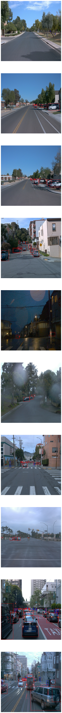
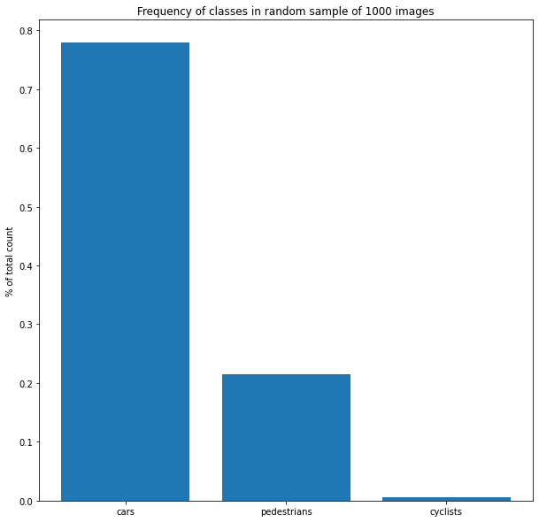
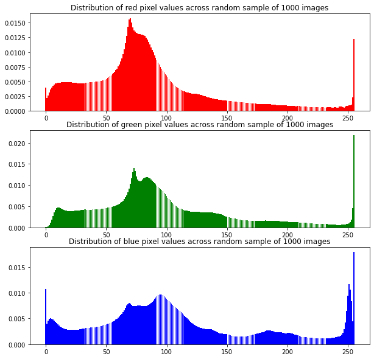
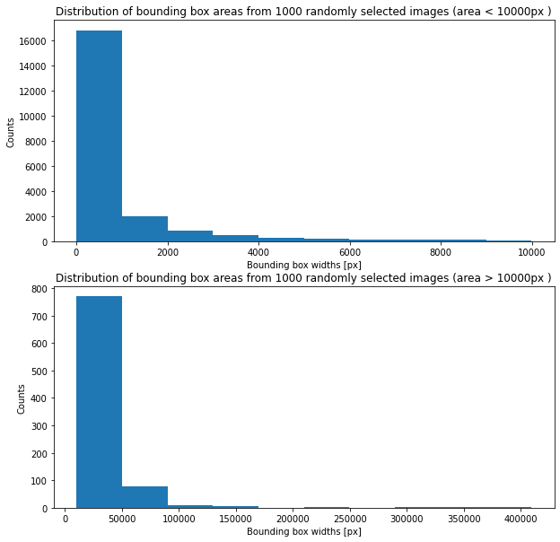
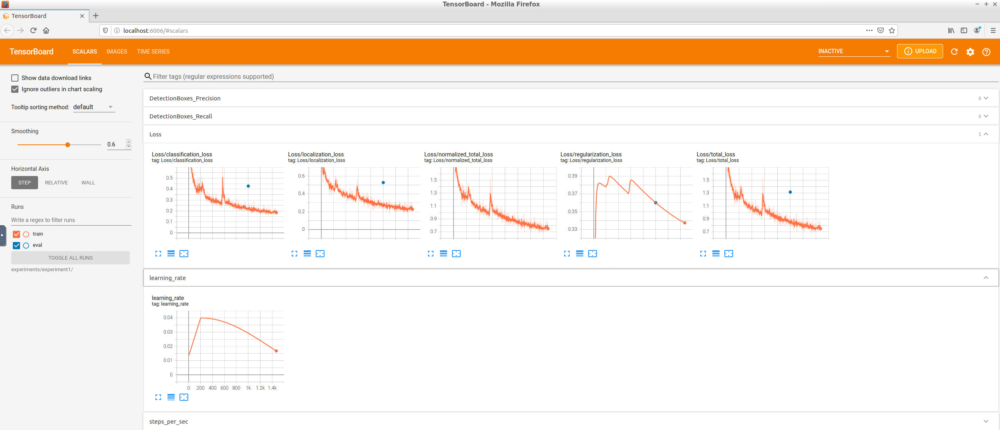
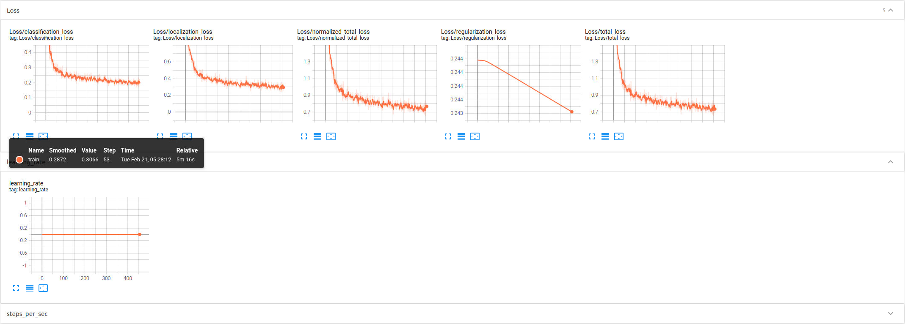
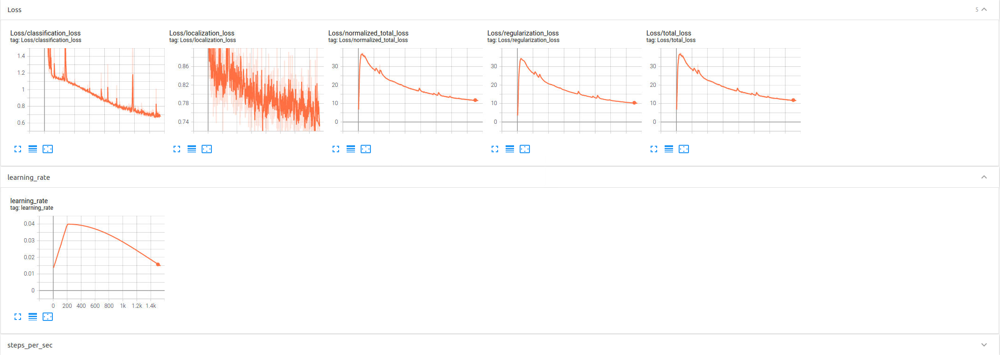

# Object Detection in an Urban Environment Project Submission
## Author: Kurtis Gibson

### Project Overview

### Set Up

### Dataset

#### Exploratory Data Analysis

I initially did an informal, qualitative analysis of the data by manually running my `display_instances` function  over and over again.
The function would display 10 random ground truth images with annotated bounding boxes.
I noticed that the majority of bounding boxes I saw were automobiles, and a smaller amount were pedestrians. It was difficult to see any cyclists so I figured that there was probably a tiny amount in the dataset.
I also noticed that only about 1 in every 10 images took place at night.
Lastly, I took note of things like occlusions, reflections on the lense, and fog/mist.



For each of the following analyses, I chose to shuffle the dataset and then take 1000 images from the randomized dataset.
I made the assumption that the 1000 randomized images from the dataset would provide a good representation for the entire dataset.

The first analysis I performed on the data was determining the frequency of classes in the image batch:



From this analysis it is apparent that automobiles are most represented and cyclists are least represented.
Depending on the size of the entire dataset, this could mean that we need to gather more images with cyclists in order to best train the model to detect cyclists.

The next analysis I performed was calculating a histogram for the pixel values of each image in the batch per channel (RGB):



One thing I note in this analysis is that there seems to be some clipping on all 3 channels as you can see a spike around 255 for each channel.

Another analysis I performed was calculating the mean and standard deviation of pixel values for each image in the batch and then plotting these values in an scatter plot of mean vs standard deviation:


From this plot it seems that there is a smaller amount of images with a small mean and standard deviation.
These images are very dark and have very few lighter pixels.
We may need to augment the dataset to include more images like this.

The last analysis I did was calculating the areas of all bounding boxes for the sample dataset. There was a small amount of very large bounding boxes that were biasing the distribution so I removed them (everything above 10000px) and plotted them separately:



From this plot it seems there is a very large number of small bounding boxes (under 1000px).
Depending on the object detection model type (such as YOLO), these small objects could prove difficult to detect. I also noticed a few bounding boxes that were the same size of the image (409600px).
On inspection these boxes seemed to be erroneous and could be removed from the dataset.

From my qualitative and quantitative analysis, the following seems to be true about the dataset:

- A little less than 80% of the annotated classes are automobiles, about 20% are pedestrians and about 1-2% are cyclists.
- There is a small amount of nighttime images, perhaps 10%.
- A large majority of the bounding boxes have an area of less than 1000px. That is less than 0.25% of the image area (1000/409600)

#### Cross-validation Approach

### Training

#### Reference Experiment

```
I0127 05:24:54.588876 139639361640192 model_lib_v2.py:988] Eval metrics at step 2500
INFO:tensorflow:    + DetectionBoxes_Precision/mAP: 0.000226
I0127 05:24:54.597585 139639361640192 model_lib_v2.py:991]  + DetectionBoxes_Precision/mAP: 0.000226
INFO:tensorflow:    + DetectionBoxes_Precision/mAP@.50IOU: 0.000875
I0127 05:24:54.599640 139639361640192 model_lib_v2.py:991]  + DetectionBoxes_Precision/mAP@.50IOU: 0.000875
INFO:tensorflow:    + DetectionBoxes_Precision/mAP@.75IOU: 0.000128
I0127 05:24:54.601336 139639361640192 model_lib_v2.py:991]  + DetectionBoxes_Precision/mAP@.75IOU: 0.000128
INFO:tensorflow:    + DetectionBoxes_Precision/mAP (small): 0.000000
I0127 05:24:54.603035 139639361640192 model_lib_v2.py:991]  + DetectionBoxes_Precision/mAP (small): 0.000000
INFO:tensorflow:    + DetectionBoxes_Precision/mAP (medium): 0.000990
I0127 05:24:54.604706 139639361640192 model_lib_v2.py:991]  + DetectionBoxes_Precision/mAP (medium): 0.000990
INFO:tensorflow:    + DetectionBoxes_Precision/mAP (large): 0.003462
I0127 05:24:54.606321 139639361640192 model_lib_v2.py:991]  + DetectionBoxes_Precision/mAP (large): 0.003462
INFO:tensorflow:    + DetectionBoxes_Recall/AR@1: 0.000030
I0127 05:24:54.608170 139639361640192 model_lib_v2.py:991]  + DetectionBoxes_Recall/AR@1: 0.000030
INFO:tensorflow:    + DetectionBoxes_Recall/AR@10: 0.002595
I0127 05:24:54.610029 139639361640192 model_lib_v2.py:991]  + DetectionBoxes_Recall/AR@10: 0.002595
INFO:tensorflow:    + DetectionBoxes_Recall/AR@100: 0.008125
I0127 05:24:54.611683 139639361640192 model_lib_v2.py:991]  + DetectionBoxes_Recall/AR@100: 0.008125
INFO:tensorflow:    + DetectionBoxes_Recall/AR@100 (small): 0.000000
I0127 05:24:54.613256 139639361640192 model_lib_v2.py:991]  + DetectionBoxes_Recall/AR@100 (small): 0.000000
INFO:tensorflow:    + DetectionBoxes_Recall/AR@100 (medium): 0.000373
I0127 05:24:54.614885 139639361640192 model_lib_v2.py:991]  + DetectionBoxes_Recall/AR@100 (medium): 0.000373
INFO:tensorflow:    + DetectionBoxes_Recall/AR@100 (large): 0.161800
I0127 05:24:54.616852 139639361640192 model_lib_v2.py:991]  + DetectionBoxes_Recall/AR@100 (large): 0.161800
INFO:tensorflow:    + Loss/localization_loss: 0.984369
I0127 05:24:54.618325 139639361640192 model_lib_v2.py:991]  + Loss/localization_loss: 0.984369
INFO:tensorflow:    + Loss/classification_loss: 0.728822
I0127 05:24:54.619867 139639361640192 model_lib_v2.py:991]  + Loss/classification_loss: 0.728822
INFO:tensorflow:    + Loss/regularization_loss: 5.543651
I0127 05:24:54.621390 139639361640192 model_lib_v2.py:991]  + Loss/regularization_loss: 5.543651
INFO:tensorflow:    + Loss/total_loss: 7.256842
I0127 05:24:54.622891 139639361640192 model_lib_v2.py:991]  + Loss/total_loss: 7.256842
```

#### Reference Experiment Improvement

##### Experiment 1




#### Experiment 2



#### Experiment 3



