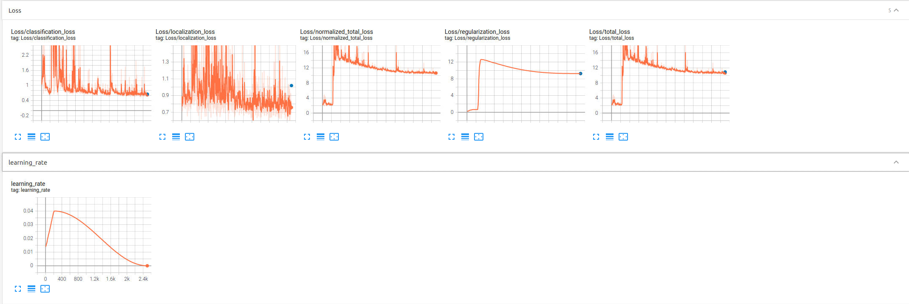

# Object Detection in an Urban Environment Project Submission
## Author: Kurtis Gibson

### Project Overview

The goal of this project is to train a deep-learning model to accurately recognize certain classes of objects in a image dataset. We are using the Waymo Open Dataset for this and the classes we are trying to detect are cars, pedestrians and cyclists. In doing so, we will learn about exploratory data analysis, using different types of object detection models, tuning hyperparameters and augmenting images within a dataset to better your results. Object detection is an extremely important part of self-driving vehicles as these vehicles should be able to operate in a range of different urban and rural environments in which they may be confronted with a diversity of potential obstacles. Safety is of upmost importance in these applications and well-tuned vision systems can take the place of human eyes.

### Set Up

### Dataset

#### Exploratory Data Analysis

I initially did an informal, qualitative analysis of the data by manually running my `display_instances` function  over and over again.
The function would display 10 random ground truth images with annotated bounding boxes.
I noticed that the majority of bounding boxes I saw were automobiles, and a smaller amount were pedestrians. It was difficult to see any cyclists so I figured that there was probably a tiny amount in the dataset.
I also noticed that only about 1 in every 10 images took place at night.
Lastly, I took note of things like occlusions, reflections on the lense, and fog/mist.


For each of the following analyses, I chose to shuffle the dataset and then take 1000 images from the randomized dataset.
I made the assumption that the 1000 randomized images from the dataset would provide a good representation for the entire dataset.

The first analysis I performed on the data was determining the frequency of classes in the image batch:


From this analysis it is apparent that automobiles are most represented and cyclists are least represented.
Depending on the size of the entire dataset, this could mean that we need to gather more images with cyclists in order to best train the model to detect cyclists.

The next analysis I performed was calculating a histogram for the pixel values of each image in the batch per channel (RGB):


One thing I note in this analysis is that there seems to be some clipping on all 3 channels as you can see a spike around 255 for each channel.

Another analysis I performed was calculating the mean and standard deviation of pixel values for each image in the batch and then plotting these values in an scatter plot of mean vs standard deviation:


From this plot it seems that there is a smaller amount of images with a small mean and standard deviation.
These images are very dark and have very few lighter pixels.
We may need to augment the dataset to include more images like this.

The last analysis I did was calculating the areas of all bounding boxes for the sample dataset. There was a small amount of very large bounding boxes that were biasing the distribution so I removed them (everything above 10000px) and plotted them separately:


From this plot it seems there is a very large number of small bounding boxes (under 1000px).
Depending on the object detection model type (such as YOLO), these small objects could prove difficult to detect. I also noticed a few bounding boxes that were the same size of the image (409600px).
On inspection these boxes seemed to be erroneous and could be removed from the dataset.

From my qualitative and quantitative analysis, the following seems to be true about the dataset:

- A little less than 80% of the annotated classes are automobiles, about 20% are pedestrians and about 1-2% are cyclists.
- There is a small amount of nighttime images, perhaps 10%.
- A large majority of the bounding boxes have an area of less than 1000px. That is less than 0.25% of the image area (1000/409600)

#### Cross-validation Approach

Since I used the provided workspace to do this project, the data was already split up. However, if I were to split up the data myself, my cross-validation approach would be the following:
- Shuffle the dataset to increase variance and avoid overfitting of training data
- 
-


### Training

#### Reference Experiment



```
INFO:tensorflow:Eval metrics at step 2500
I0225 20:13:04.548510 139634023094016 model_lib_v2.py:988] Eval metrics at step 2500
INFO:tensorflow:    + DetectionBoxes_Precision/mAP: 0.000033
I0225 20:13:04.557912 139634023094016 model_lib_v2.py:991]  + DetectionBoxes_Precision/mAP: 0.000033
INFO:tensorflow:    + DetectionBoxes_Precision/mAP@.50IOU: 0.000221
I0225 20:13:04.559884 139634023094016 model_lib_v2.py:991]  + DetectionBoxes_Precision/mAP@.50IOU: 0.000221
INFO:tensorflow:    + DetectionBoxes_Precision/mAP@.75IOU: 0.000003
I0225 20:13:04.561666 139634023094016 model_lib_v2.py:991]  + DetectionBoxes_Precision/mAP@.75IOU: 0.000003
INFO:tensorflow:    + DetectionBoxes_Precision/mAP (small): 0.000524
I0225 20:13:04.563529 139634023094016 model_lib_v2.py:991]  + DetectionBoxes_Precision/mAP (small): 0.000524
INFO:tensorflow:    + DetectionBoxes_Precision/mAP (medium): 0.000088
I0225 20:13:04.565413 139634023094016 model_lib_v2.py:991]  + DetectionBoxes_Precision/mAP (medium): 0.000088
INFO:tensorflow:    + DetectionBoxes_Precision/mAP (large): 0.000035
I0225 20:13:04.567128 139634023094016 model_lib_v2.py:991]  + DetectionBoxes_Precision/mAP (large): 0.000035
INFO:tensorflow:    + DetectionBoxes_Recall/AR@1: 0.000020
I0225 20:13:04.568839 139634023094016 model_lib_v2.py:991]  + DetectionBoxes_Recall/AR@1: 0.000020
INFO:tensorflow:    + DetectionBoxes_Recall/AR@10: 0.000230
I0225 20:13:04.570428 139634023094016 model_lib_v2.py:991]  + DetectionBoxes_Recall/AR@10: 0.000230
INFO:tensorflow:    + DetectionBoxes_Recall/AR@100: 0.003334
I0225 20:13:04.572417 139634023094016 model_lib_v2.py:991]  + DetectionBoxes_Recall/AR@100: 0.003334
INFO:tensorflow:    + DetectionBoxes_Recall/AR@100 (small): 0.000746
I0225 20:13:04.573936 139634023094016 model_lib_v2.py:991]  + DetectionBoxes_Recall/AR@100 (small): 0.000746
INFO:tensorflow:    + DetectionBoxes_Recall/AR@100 (medium): 0.019776
I0225 20:13:04.575543 139634023094016 model_lib_v2.py:991]  + DetectionBoxes_Recall/AR@100 (medium): 0.019776
INFO:tensorflow:    + DetectionBoxes_Recall/AR@100 (large): 0.001600
I0225 20:13:04.577244 139634023094016 model_lib_v2.py:991]  + DetectionBoxes_Recall/AR@100 (large): 0.001600
INFO:tensorflow:    + Loss/localization_loss: 1.018727
I0225 20:13:04.578658 139634023094016 model_lib_v2.py:991]  + Loss/localization_loss: 1.018727
INFO:tensorflow:    + Loss/classification_loss: 0.654525
I0225 20:13:04.580101 139634023094016 model_lib_v2.py:991]  + Loss/classification_loss: 0.654525
INFO:tensorflow:    + Loss/regularization_loss: 9.250709
I0225 20:13:04.581506 139634023094016 model_lib_v2.py:991]  + Loss/regularization_loss: 9.250709
INFO:tensorflow:    + Loss/total_loss: 10.923960
I0225 20:13:04.582908 139634023094016 model_lib_v2.py:991]  + Loss/total_loss: 10.923960
```

#### Reference Experiment Improvement

##### Experiment 1


#### Experiment 2


#### Experiment 3


#### Experiment 4


